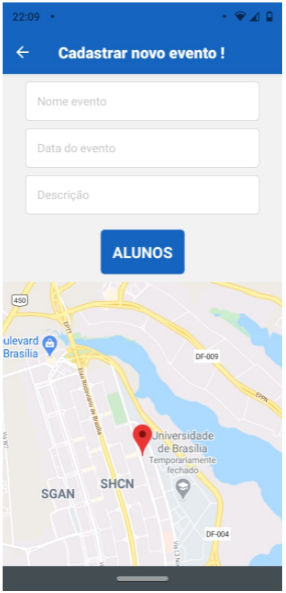
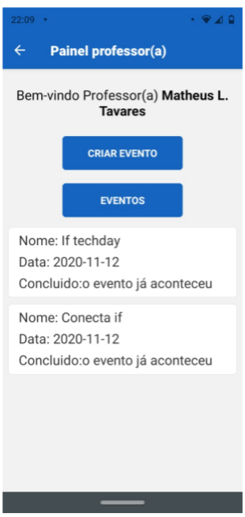

<h1 align="center">
  
</h1>

Um app de controle de presença estudantil em evento!

🚧 projeto em andamento 🚧

 

  
  
  

 

## 📄 **Sobre este projeto**

Este um sistema que foi o tema central do meu TCC na faculdade de sistemas para a internet, tendo este aplicativo sua principal função ser um sistema na qual professores podem fazer o controle de presença de alunos de uma forma mais fácil sem precisar parar em algum ponto do evento para reunir sua turma

Também um ponto importante é que ele é completamente modular, conseguindo se moldar a qualquer instituição de ensino com algumas leves alterações no banco de dados.

 

---
 

## 🤹‍♀️ Funcionalidades
- Sistema de login
- implementação de mapas
- cadastro de novos eventos
- localização geografica

 

## 🚀 Tecnologias

- [Node.js](https://nodejs.org/en/)
- [Eslint](https://eslint.org/)
- [Prettier](https://prettier.io/)
- [expo](https://docs.expo.dev/)
- [react-navigation](https://reactnavigation.org/)
- [cors](https://www.npmjs.com/package/cors)
- [express](https://expressjs.com/pt-br/)
- [jsonwebtoken](https://github.com/auth0/node-jsonwebtoken)
- [mongoose](https://mongoosejs.com/)
- [async-storage](https://react-native-async-storage.github.io/async-storage/docs/usage/)
- [geolocation](https://github.com/react-native-geolocation/react-native-geolocation)

 

## 🔨 Configuração

1- Para instalar as dependências do back-end:
> yarn

2- Para iniciar a aplicação:
> yarn start

3- Para instalar as dependências do mobile:
> yarn

4- Para iniciar a aplicação:
> yarn start

5- Para poder gerar um apk:
> expo build:android

---

Feito com 💜 por LEONARDO M. 👋 [veja meu linkedin](https://www.linkedin.com/in/leonardo-muniz-a39984144/)
 

